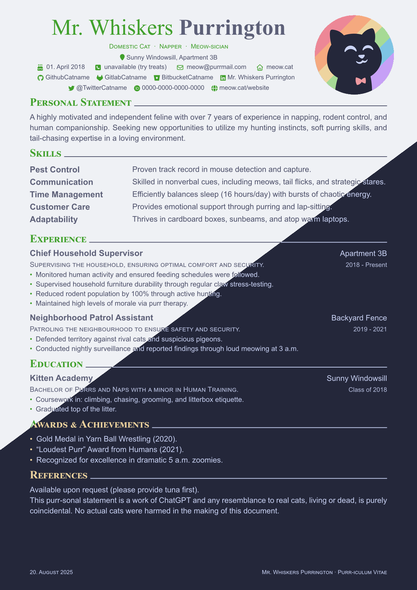

A CV Template with the typst [catpuccin theme](https://github.com/catppuccin/typst).

Yoinked most code from
[modern-cv](https://typst.app/universe/package/modern-cv/)
and some from
[brilliant-cv](https://typst.app/universe/package/brilliant-cv).

  

